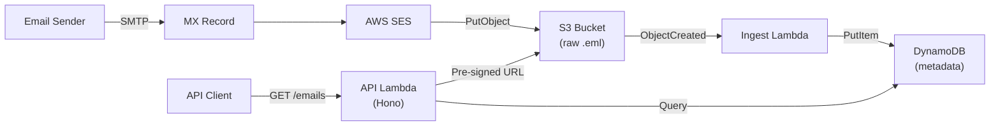

# ses-inbox

[](https://github.com/RodPaDev/ses-inbox/actions/workflows/ci.yml)

Serverless inbound email API. Receives emails via AWS SES, stores raw `.eml` files in S3, indexes metadata in DynamoDB, and exposes a REST API to query and retrieve them.

Built for E2E testing workflows and email ingestion pipelines.

## Architecture



## Quick Start

```bash
git clone <your-repo-url> ses-inbox
cd ses-inbox
bun install
cp .env.example .env     # Configure AWS_REGION, SES_DOMAIN, etc.
bun run deploy:dev       # Deploy to AWS
bun run provision --create --name my-key  # Create an API key
```

Then query emails:

```bash
curl -H "Authorization: Bearer <token>" \
  "<api-url>/emails?inbox=test&wait=true"
```

## Documentation

- **[Getting Started](./docs/getting-started.md)** — philosophy, setup, project structure
- **[Deployment Guide](./docs/deployment.md)** — DNS setup, hosted zones, MX verification, troubleshooting
- **[API Reference](./docs/api-reference.md)** — endpoints, authentication, request/response examples

## Scripts

| Command | Description |
| --- | --- |
| `bun run deploy:dev` | Deploy to dev stage |
| `bun run deploy:prod` | Deploy to production |
| `bun run dev` | Start SST dev mode (live Lambda) |
| `bun run remove:dev` | Remove dev stage |
| `bun run provision` | Manage API keys |
| `bun run test` | Run tests |
| `bun run lint` | Run Biome linter |

## Project Structure

```text
├── sst.config.ts                  # SST app configuration
├── scripts/provision.ts           # API key management CLI
├── packages/
│   ├── api/src/
│   │   ├── index.ts               # Hono API (GET /emails, /raw, /health)
│   │   ├── ingest.ts              # S3 event → parse email → DynamoDB
│   │   ├── lib/dynamo.ts          # DynamoDB read/write operations
│   │   ├── lib/email-parser.ts    # Email header extraction
│   │   └── middleware/auth.ts     # Bearer token authentication
│   └── infra/src/
│       ├── index.ts               # S3, DynamoDB, Lambda definitions
│       └── ses-inbound.ts         # SES receipt rules (raw Pulumi)
```

## License

[MIT](./LICENSE)
