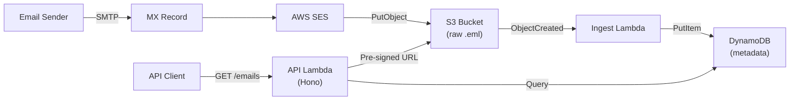

# mail-catcher

[](https://github.com/rodavel-labs/mail-catcher/actions/workflows/ci.yml)

Serverless inbound email API. Receives emails via AWS SES, stores raw `.eml` files in S3, indexes metadata in DynamoDB, and exposes a REST API to query and retrieve them.

Built for E2E testing workflows and email ingestion pipelines.

## Architecture



## Quick Start

```bash
git clone <your-repo-url> mail-catcher
cd mail-catcher
bun install
cp .env.example .env     # Configure AWS_REGION, SES_DOMAIN, etc.
bun run deploy:dev       # Deploy to AWS
bun run provision --create --name my-key  # Create an API key
```

Then query emails:

```bash
curl -H "Authorization: Bearer <token>" \
  "<api-url>/emails?inbox=test&wait=true"
```

## Documentation

Full documentation is available at [rodavel.com/docs/mail-catcher](https://rodavel.com/collection/mail-catcher).

## Scripts

| Command | Description |
| --- | --- |
| `bun run deploy:dev` | Deploy to dev stage |
| `bun run deploy:prod` | Deploy to production |
| `bun run dev` | Start SST dev mode (live Lambda) |
| `bun run remove:dev` | Remove dev stage |
| `bun run provision` | Manage API keys |
| `bun run test` | Run tests |
| `bun run lint` | Run Biome linter |

## Project Structure

```text
├── sst.config.ts                  # SST app configuration
├── scripts/provision.ts           # API key management CLI
├── apps/
│   ├── api/src/                   # REST API (Hono on Lambda)
│   │   ├── index.ts               # App factory and route setup
│   │   ├── routes/v1/emails.ts    # Email endpoints
│   │   ├── middleware/auth.ts     # Bearer token authentication
│   │   └── schemas.ts            # Zod validation schemas
│   └── ingest/src/                # Email parser (S3 event handler)
│       ├── ingest.ts              # S3 event → parse → DynamoDB
│       └── email-parser.ts        # RFC 5322 header extraction
├── packages/
│   ├── core/src/                  # Shared DynamoDB operations
│   │   └── dynamo.ts              # Read/write/delete operations
│   └── infra/src/                 # AWS infrastructure definitions
│       ├── index.ts               # S3, DynamoDB, Lambda, Router
│       └── ses-inbound.ts         # SES receipt rules and DNS
├── e2e/                           # End-to-end tests
```

## License

[MIT](./LICENSE)
