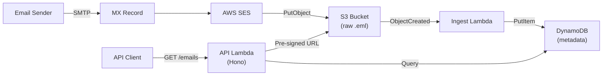
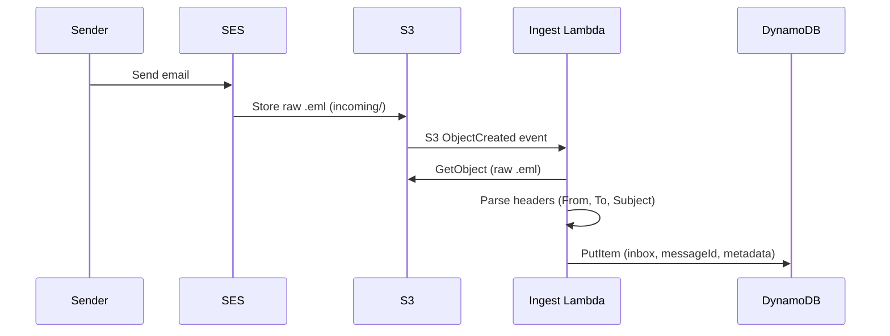
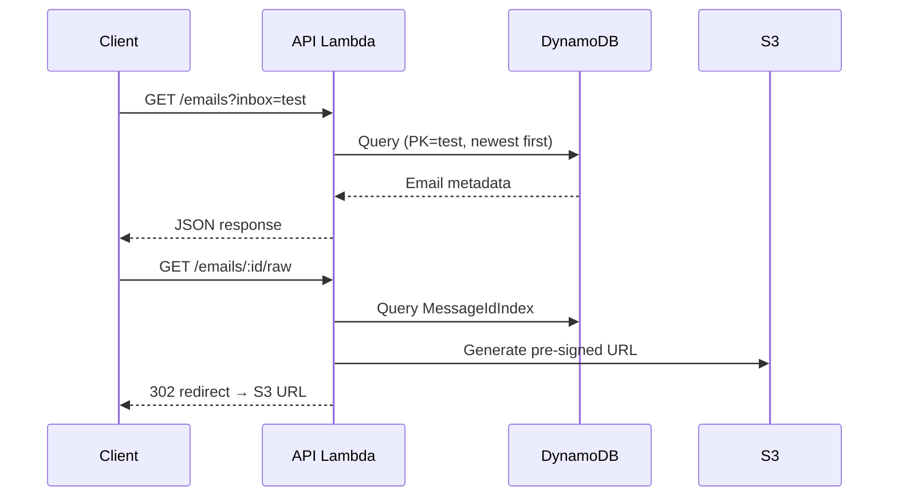

# ses-inbox

Serverless inbound email API. Receives emails via AWS SES, stores raw `.eml` files in S3, indexes metadata in DynamoDB, and exposes a REST API to query and retrieve them.

Built for E2E testing workflows and email ingestion pipelines.

## Architecture



### Email Ingestion Flow



### Email Retrieval Flow



## Prerequisites

- [Bun](https://bun.sh)
- [SST v4](https://sst.dev) (`npm i -g sst`)
- AWS account with SES inbound email enabled in your region
- A domain (or subdomain) for receiving emails

## Setup

```bash
bun install
cp .env.example .env
```

Configure `.env`:

```
SES_DOMAIN=receive.yourdomain.com
HOSTED_ZONE_ID=Z1234567890  # Optional: auto-manages DNS via Route 53
```

If `HOSTED_ZONE_ID` is omitted, the deploy output will print the DNS records you need to add manually.

## Deploy

```bash
bun run deploy:dev       # Deploy to dev stage
bun run deploy:prod      # Deploy to production stage
```

## Development

```bash
bun run dev              # Start SST dev mode (live Lambda)
```

## API Key Management

After deploying, create an API key to authenticate requests:

```bash
bun run provision --create --name my-key
```

The token is shown once and cannot be retrieved again. Store it securely.

```bash
bun run provision --list              # List all keys
bun run provision --revoke <keyId>    # Revoke a key
```

## API

All `/emails` endpoints require `Authorization: Bearer <token>`.

### `GET /health`

Returns `{ "status": "ok", "timestamp": 1234567890 }`.

### `GET /emails`

Query parameters:

| Param     | Required | Default | Description                          |
|-----------|----------|---------|--------------------------------------|
| `inbox`   | yes      |         | Inbox name (local part of the email) |
| `limit`   | no       | 50      | Results per page (1-100)             |
| `cursor`  | no       |         | Pagination cursor from previous call |
| `wait`    | no       | false   | Enable long-poll mode                |
| `timeout` | no       | 28      | Long-poll max wait in seconds        |

Response:

```json
{
  "emails": [
    {
      "messageId": "abc123",
      "inbox": "test",
      "sender": "sender@example.com",
      "recipient": "test@receive.yourdomain.com",
      "subject": "Hello",
      "receivedAt": 1234567890,
      "rawUrl": "/emails/abc123/raw"
    }
  ],
  "nextCursor": "...",
  "hasMore": false
}
```

### `GET /emails/:messageId/raw`

Returns a `302` redirect to a pre-signed S3 URL (15-minute expiry) for the raw `.eml` file.

## Data Retention

- DynamoDB: 7-day TTL
- S3: 8-day lifecycle expiration
- The 1-day buffer ensures S3 objects are cleaned up after their index entries expire.

## Teardown

```bash
bun run remove:dev       # Remove dev stage
```

## Project Structure

```
├── sst.config.ts                  # SST app configuration
├── scripts/provision.ts           # API key management CLI
├── packages/
│   ├── api/src/
│   │   ├── index.ts               # Hono API (GET /emails, /raw, /health)
│   │   ├── ingest.ts              # S3 event → parse email → DynamoDB
│   │   ├── lib/dynamo.ts          # DynamoDB read/write operations
│   │   ├── lib/email-parser.ts    # Email header extraction
│   │   └── middleware/auth.ts     # Bearer token authentication
│   └── infra/src/
│       ├── index.ts               # S3, DynamoDB, Lambda definitions
│       └── ses-inbound.ts         # SES receipt rules (raw Pulumi)
```
